# Uživatelská příručka

Pokus o vytvoření uživatelské příručky k obsluze klientské aplikace MWEClient.

> Tato klientská aplikace je vyvýjena za účelem otestování funkcionality workflow systému MWE, a proto vyžaduje ke svému fungování připojení k serveru MWE ([MWEServer](https://github.com/MWarCZ/MWEServer)).

## Obsah
- [Uživatelská příručka](#uživatelská-příručka)
  - [Obsah](#obsah)
  - [Představení klientské aplikace](#představení-klientské-aplikace)
    - [Přihlášení do systému](#přihlášení-do-systému)
    - [Úvodní obrazovka a hlavní prvky aplikace](#úvodní-obrazovka-a-hlavní-prvky-aplikace)
    - [Šablony procesů](#šablony-procesů)
    - [Uzly pro mne](#uzly-pro-mne)
    - [Moje uzly](#moje-uzly)
    - [Šablona procesu](#šablona-procesu)
    - [Instance procesu](#instance-procesu)
    - [Instance uzlu](#instance-uzlu)
    - [Skupiny](#skupiny)
    - [Uživatelé](#uživatelé)
  - [Provádění interakcí se systémem](#provádění-interakcí-se-systémem)
    - [Nahrání nové šablony procesu do systému](#nahrání-nové-šablony-procesu-do-systému)
    - [Úprava šablony procesů v systému](#úprava-šablony-procesů-v-systému)
    - [Smazání šablony procesů ze systému](#smazání-šablony-procesů-ze-systému)
    - [...](#)
    - [Spuštení nové instance podnikového procesu](#spuštení-nové-instance-podnikového-procesu)
    - [Stažení běžící instance podnikového procesu](#stažení-běžící-instance-podnikového-procesu)
    - [Smazání instance podnikového procesu](#smazání-instance-podnikového-procesu)
    - [...](#-1)
    - [Obsloužení čekající instance uzlu/úlohy](#obsloužení-čekající-instance-uzluúlohy)
    - [...](#-2)
    - [Vytvoření nového uživatele](#vytvoření-nového-uživatele)
    - [Upravení informací uživatele](#upravení-informací-uživatele)
    - [Změna hesla uživatele](#změna-hesla-uživatele)
    - [Restart hesla uživatele](#restart-hesla-uživatele)
    - [Uzamknutí/Odemknutí uživatelského účtu](#uzamknutíodemknutí-uživatelského-účtu)
    - [Odstranění/Obnovení uživatele](#odstraněníobnovení-uživatele)
    - [Trvalé smazání uživatele](#trvalé-smazání-uživatele)
    - [...](#-3)
    - [Vytvoření nové uživatelské skupiny](#vytvoření-nové-uživatelské-skupiny)
    - [Upravení informací o uživatelské skupině](#upravení-informací-o-uživatelské-skupině)
    - [Odstranění/Obnovení uživatelské skupiny](#odstraněníobnovení-uživatelské-skupiny)
    - [Trvalé smazání uživatelské skupiny](#trvalé-smazání-uživatelské-skupiny)
    - [Přidání uživatele do skupiny](#přidání-uživatele-do-skupiny)
    - [Odebrání uživatele ze skupiny](#odebrání-uživatele-ze-skupiny)
    - [Přidání/Odebrání lokálních práv pro administraci členů skupiny](#přidáníodebrání-lokálních-práv-pro-administraci-členů-skupiny)
  - [...](#-4)

## Představení klientské aplikace

### Přihlášení do systému

První okno, se kterým se setkáte, je přihlašovací dialog.
Bez platného přihlášení vás aplikace dále nepustí.

Vaše přihlašovací údaje vám poskytne administrátor, který spravuje uživatele v daném systému.
V případě nového systému použijte přihlášení skrze výchozí uživatelské účty (viz. [Manuál k systému MWE](https://github.com/MWarCZ/MWEServer/tree/master/doc#v%c3%bdchoz%c3%ad-%c3%ba%c4%8dty-a-p%c5%99ihla%c5%a1ovac%c3%ad-%c3%badaje)).

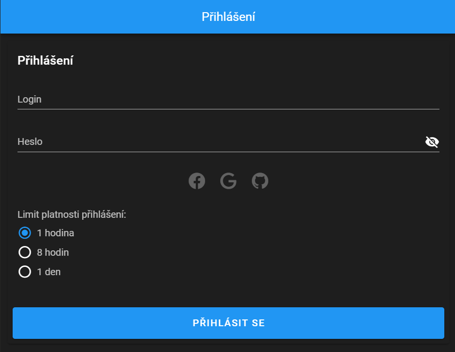

> Současná verze umožňuje přihlášení jen pomocí přihlašovacího jména a hesla.

### Úvodní obrazovka a hlavní prvky aplikace

Úvodní obrazovka obsahuje uvítání a odkazy na repositáře git, které obsahují zdrojové texty k projektu MWEClient a MWEServer a jsou veřejně přístupné na webu Github.

Horní lišta v aplikaci obsahuje na levé straně ikonu menu pro jeho trvalé připnutí.

Na pravé straně horní lišty se nachází indikace přihlášeného uživatele s rozbalovací nabídkou pro odhlášení a vedle jest umísteno tlačítko pro přepínání mezi světlým a temným režimem.

Světlý režim aplikace:
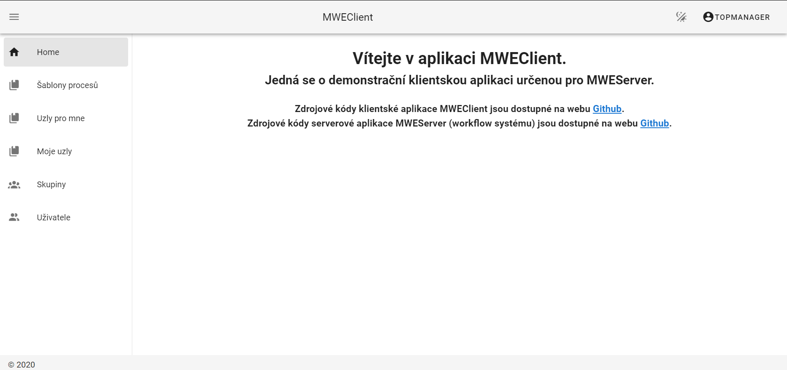

Temný/Noční režim aplikace:
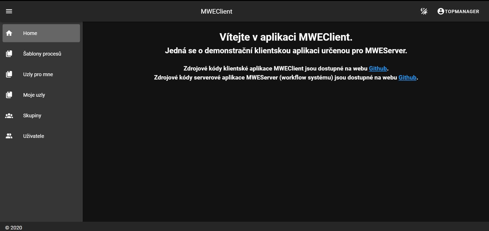

Levá strana aplikace obsahuje hlavní navigační menu.

Položky navigačního menu:
- Home
  - Úvodní obrazovka
- Šablony procesů
  - Seznam dostupných šablon podnikových procesů v systému
- Uzly pro mne
  - Čekající úlohy (uzly) na obsloužení, které můžete vy zabrat a obsloužit.
- Moje uzly
  - Vámi obsazené úlohy (uzly).
- Skupiny
  - Seznam uživatelských skupin v systému
- Uživatelé
  - Seznam uživatelských účtů v systému

### Šablony procesů

Položka Šablony procesů v navigačním menu aplikace vede k seznamu, který obsahuje šablony podnikových procesů, jenž jsou v systému dostupné.

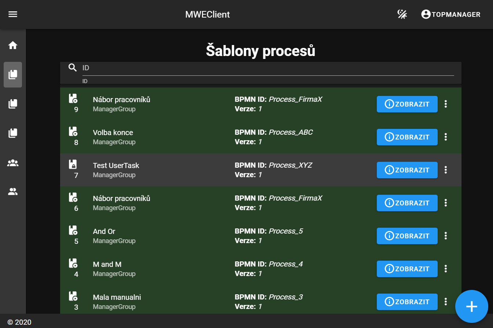

Každá položka v seznamu představuje jednu šablonu podnikového procesu.
Zelenou barvu mají spustitelné podnikové procesy a šedou barvou jsou označeny nespustitelné podnikové procesy.

Šablony procesů je možné vyhledávat dle jejich identifikátoru (id). 

V pravém dolním rohu se nachází modré kulaté tlačítko, které umožnuje nahrát do systému novou šablonu procesu (Viz. [Nahrání nové šablony procesu](#nahrání-nové-šablony-procesu)).

Spustitelné podnikové procesy v seznamu je možné rozbalit a spustit jejich novou instanci prostřednictvím jedné z počátečních událostí.

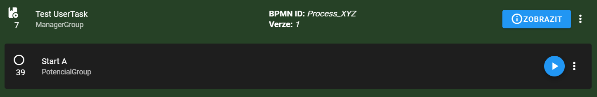

Další akce, které je možné se šablonami podnikových procesů provádět, jsou k nalezení ve sbalovací nabídce schovaného pod trojtečkou v pravé části každé položky představující šablonu procesu.

Zároveň u každé položky představující šablonu procesu se nachází modré tlačítko s textem _Zobrazit_, které vás přesměruje na obrazovku [Šablona procesu](#šablona-procesu), jenž obsahuje podrobné informace o dané šablone podnikového procesu.

### Uzly pro mne

Na tuto obrazovku se dostanete prostřednictvím položky navigačního menu _Uzly pro mne_.

Je zde dostupný seznam úloh čekajících na obsloužení uživatelem.
Každý uživatel zde vidí pouze instance úloh (uzlů), které může on sám obsloužit.

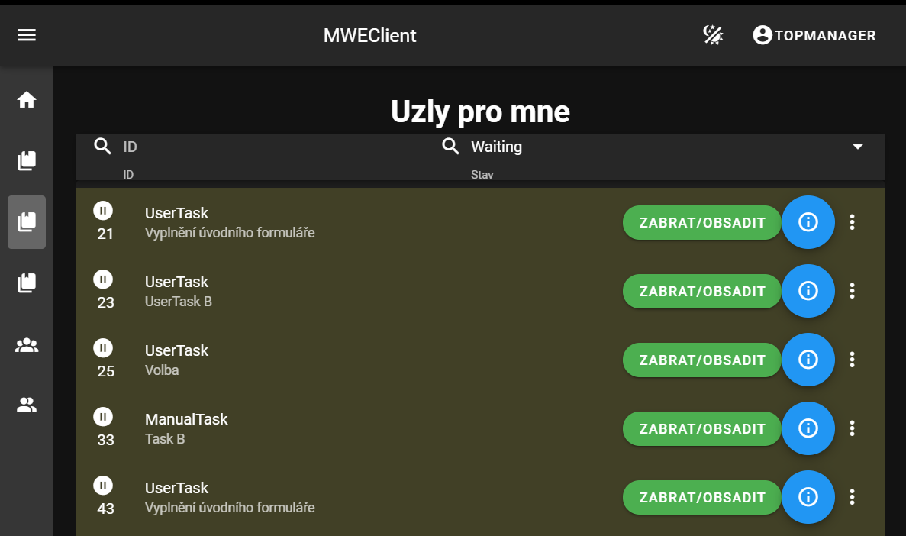

U každé položky seznamu, která představuje čekající úlohu, se nachází dvojice tlačítek.
Zelené tlačítko umožňuje zabrat danou instanci úlohy (uzlu) k pozdějšímu obsloužení, které je možné poté nalézt na obrazovce [Moje uzly](#moje-uzly).
Modré tlačítko s ikonou slouží ke zobrazení obrazovky s detaily o dané instanci úlohy (uzlu) (viz. [Instance uzlu](#instance-uzlu)).

### Moje uzly

Na tuto obrazovku se dostanete prostřednictvím položky navigačního menu _Moje uzly_.

Nachází se zde seznam obsahující vámi zabrané či obsloužené instance uzlů.

Instance uzlů je možné zde filtrovat podle identifikátoru (id) nebo podle jejich stavu.
Ve výchozím případě jsou zobrazeny vámi zabrané čekající instance uzlů na obsloužení.

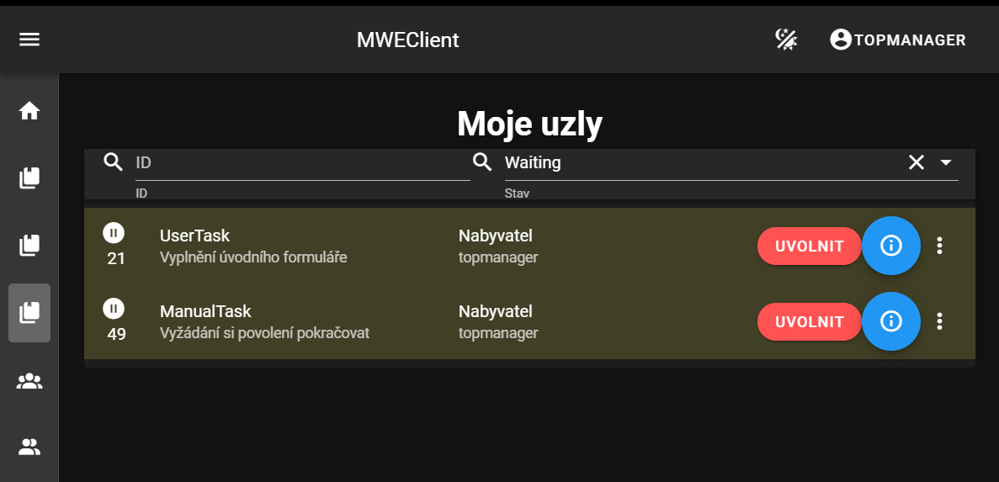

Každá položka seznamu obsahuje dvojici tlačítek.
Červeně barevné tlačítko slouží k uvolnění zabrané instance, aby mohl danou instanci zabrat a obsloužit jiný uživatel.
Modré tlačítko s ikonou slouží ke zobrazení obrazovky s detaily o dané instanci úlohy (uzlu) (viz. [Instance uzlu](#instance-uzlu)).

### Šablona procesu

Tato obrazovka ukazuje základní informace o podnikovém procesu, kterými jsou jeho spustitelnost, identifikátor, název aj.
Dále je zde dostupná dvojice seznamů.
První z nich je seznam Šablon uzlů, ze kterých se daná šablona procesu skládá, a druhým z nich je seznam instancí procesů, které byly spuštený z daná šablony procesu. 

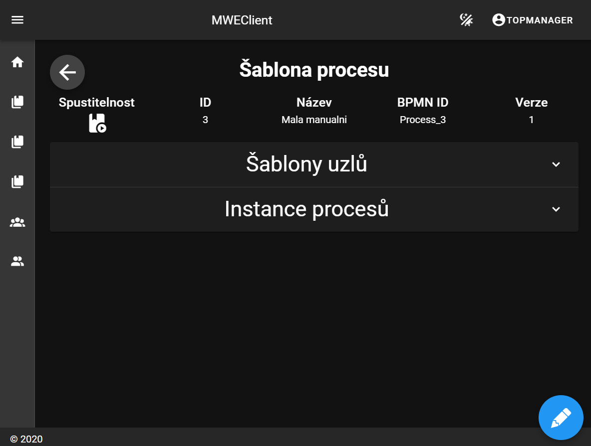

Pro otevření diologu k upravení informací o šabloně procesů slouží modré tlačítko v pravém dolním rohu.

Seznam šablon uzlů obsahuje všechny uzly, z nichž se šablona procesu skládá.
U uzlů, které představují počáteční událost, je možné nalézt modré tlačítko, jenž slouží k spuštění nové instance procesu na dané události.

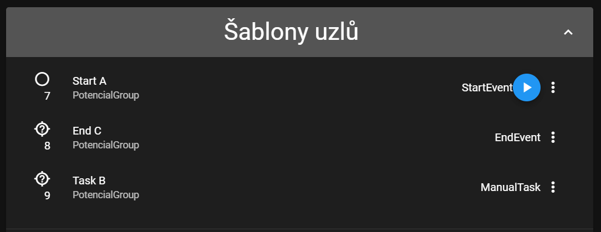

Seznam instancí procesu obsahuje všechny instance procesů, které byly spušteny z dané šablony procesu.
Stav, ve kterém se instance procesu nachází, je možné rozlišit dle úvodní ikony a barvy pozadí.
Modrá barva označuje úspěšne dokončené, šedá barva značí násilně ukončený proces, zelená jest barvou aktivního procesu, červená udává neúspěšný proces a bezbarvý je proces, který byl odvolán/stažen.

Prostřednictvím modrého tlačítka u každé položky představující instanci procesu je možné se dostat na obrazovku s podrobnějšími informacemi o dané instanci procesu (viz. [Instance procesu](#instance-procesu)).

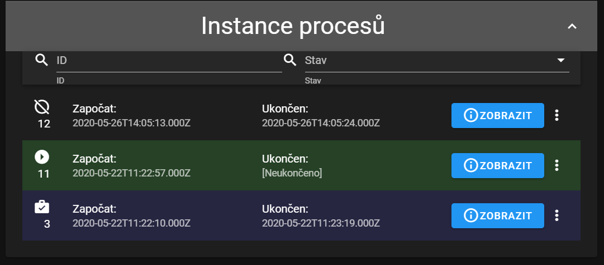

### Instance procesu

Obrazovka Instance procesu zobrazuje mimo základních informací o instanci procesu také základní informace o šabloně procesu.
Dále zde je i seznam instancí uzlů, které tvoří běžící instanci procesu.

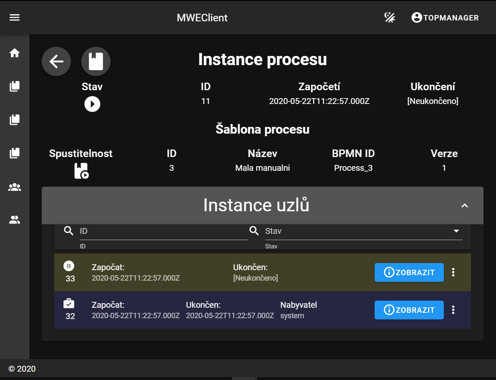

Jednotlivé položky tvořící seznam instancí uzlů mohou nabívat různých barev v závislosti na jejich stavu.
Dokončené instance mají modrou barvu, čekající instance jsou nažloutlé, neúspěšné instance jsou označeny červenou barvou, přerušené šedo a zrušené/stažené jsou bezbarvé.

Modré tlačítko u každé položky seznamu přesměruje na obrazovku s detailními informacemi o zvolené instanci uzlu (viz. [Instance uzlu](#instance-uzlu)).

### Instance uzlu

Tato obrazovka ukazuje základní informace o instanci uzlu a její šabloně uzlu.

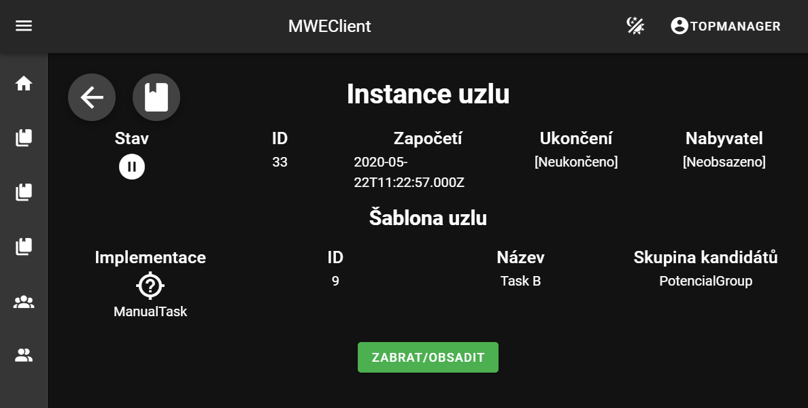
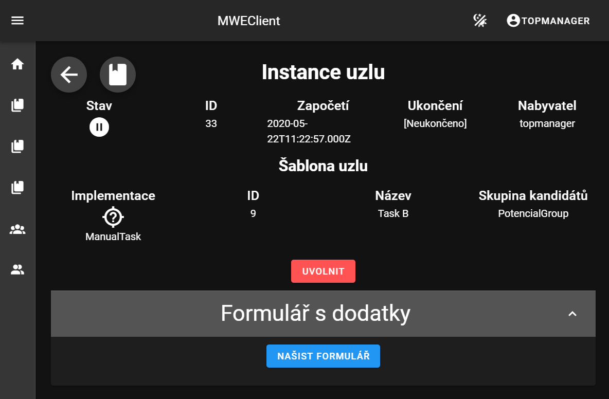
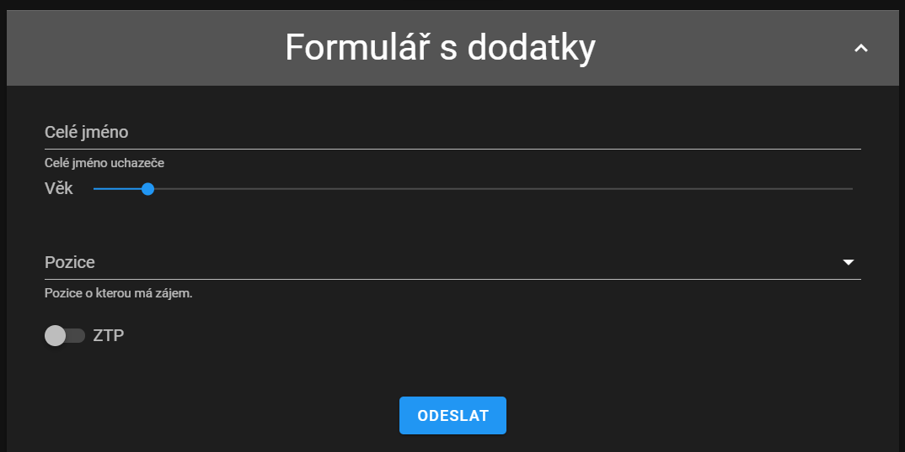

### Skupiny

Přes položku Skupiny z navigačního menu aplikace se dostanete na obrazovku Skupiny.
Zde se nachází seznam uživatelských skupin dostupných v systému.

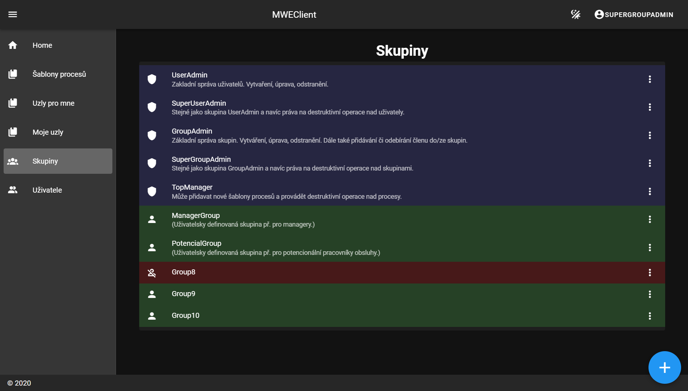

Položky seznamu, které představují jednotlivé skupiny, mohou nabývat různých barev a ikon v závislosti na jejich stavu.
Ikona štítu a modrá barva označuje systémem chráněnné skupiny. Zelená barva a ikona panáčka označují běžné skupiny. Poslední červená barva a přeškrtlý panáček označují odstraněnou skupinu.

Pro otevření dialogu za účelem vytvoření nového uživatele slouží kulaté modré tlačítko v pravém dolním rohu.

Pod trojtečkou u každé položky seznamu se skrývá rozbalovací nabídka s akcemi, které lze nad skupinou provádět.

Po rozkliknutí skupiny se rozbalí seznam členů skupiny.

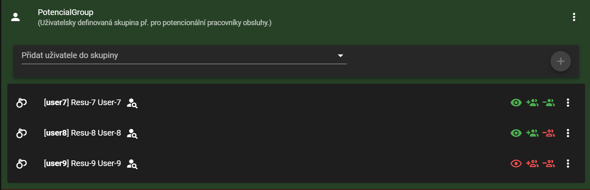

### Uživatelé

Položka uživatelé vás dostane na obrazuvku se seznamem uživatelů.
Zde se nachází seznam uživatelských účtů dostupných v systému MWE.

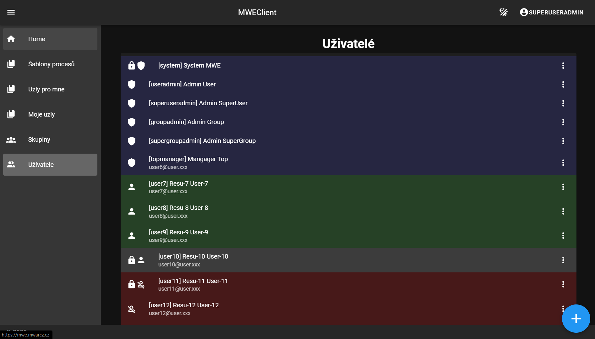

Systémem chráněnné uživatelské účty jsou označeny ikonou štítu a zároveň mají modrou barvu.
Zelenou barvou a ikonou "panáčka" jsou odlišeny běžné aktivní uživatelské účty.
Ikona zámečku označuje zamklé uživatelské účty, ke kterým není možné se přihlašovat.
Červené označení patří odstraněným uživatelským účtům.
Jedná se o účty bývalých pracovníků firmy, kteří stále zůstávají v systémy pro účely záznamu hisorie obsloužených úloh.

V dolním pravém rohu se nachází modré kulaté tlačítko s ikonou plus.
To slouží k provedení vytvoření nového uživatelského účtu do systému (Viz. [Vytvoření nového uživatele](#vytvoření-nového-uživatele)).

Pod trojtečkou na pravé straně každého prvku představujícího uživatele se skrývá rozbalovací nabídka s akcemi.

Akce proveditelné nad uživatelem jsou:
- .[Upravení informací](#upravení-informací-uživatele)
- [Uzamknutí účtu](#uzamknutíodemknutí-uživatelského-účtu)
- [Odemknutí účtu](#uzamknutíodemknutí-uživatelského-účtu)
- [Odstanění uživatele](#odstraněníobnovení-uživatele)
- [Obnovení odstraněného uživatele](#odstraněníobnovení-uživatele)
- [Trvalé smazání uživatele](#trvalé-smazání-uživatele)

## Provádění interakcí se systémem

Zde se nachází návody na provedení některých interakcí.

### Nahrání nové šablony procesu do systému

1. Přejtěte na obrazovku __Šablony procesů__

2. V pravém dolním rohu klikněte na __kulaté modré tlačítko s ikonou plus__.
3. Otevřel se vám dialog __Nahránt novou šablonu procesu__
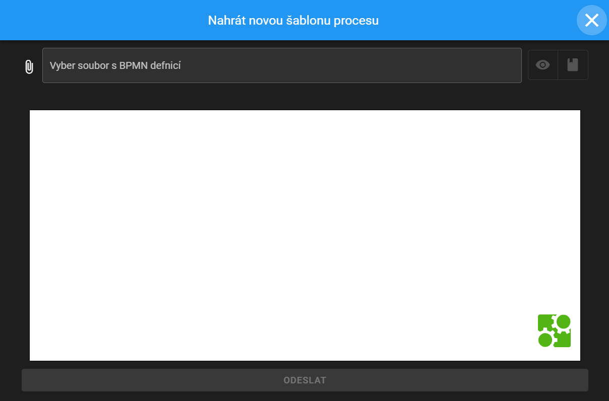
4. Klikněte na __Vybat soubor s BPMN definicí__ a vyberte soubor `*.bpmn` z vašeho zařízení.
5. Náhled vybraného souboru vidíte vykreslený na bílé ploše. _(Pokud není vidět, tak klikněnte na __symbol oka__)_
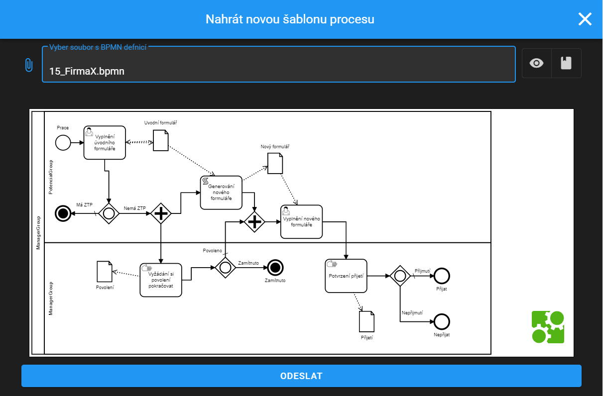
6. Pokud chcete provést manuální úpravu vybraného souboru, tak klikněte na __symbol knihy__, který se nachází vedle _symbolu oka_.
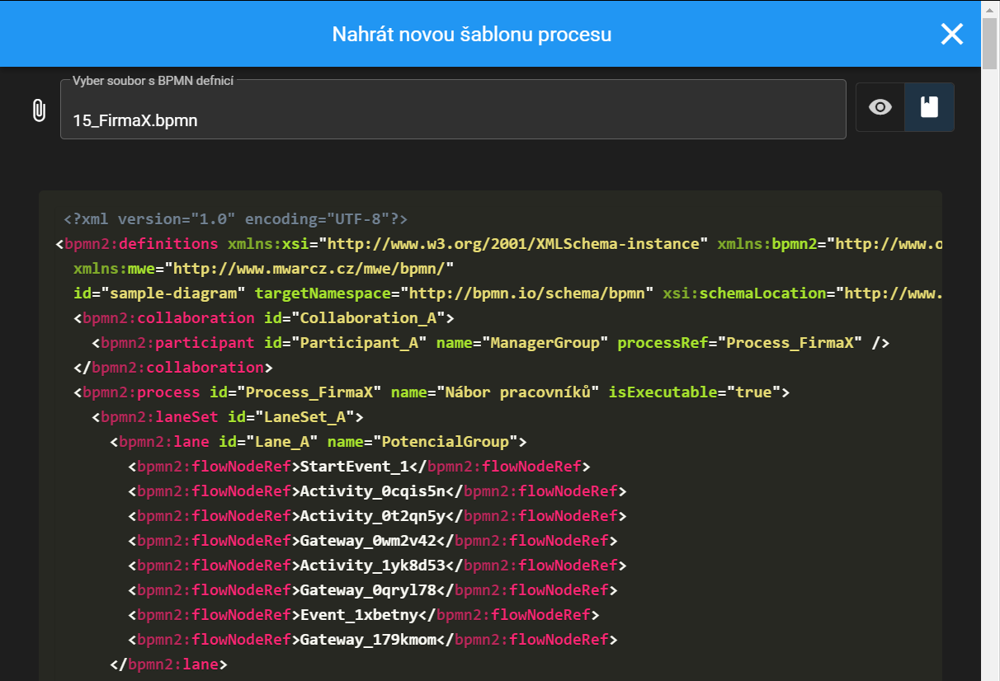
7. Na závěr klikněte na __modré tlačítko Odeslat__.

### Úprava šablony procesů v systému
1. Existuje více výchozích bodů:
   1. Přes obrazovku __Šablony procesů__
      1. Přejtěte na obrazovku __Šablony procesů__.

      2. Klikněte na __tlačítko s trojtečkou__ a ve zobrazené nabídce vyberte možnost __Upravit__.
   2. Přes obrazovku __Šablona procesu__.
      1. Přejděte na obrazovku __Šablona procesu__.

      2. V pravím dolním rohu klikněte na __kulaté modré tlačítko s ikonou tužky__. 
2. Otevře se vám dialog __Upravit šablonu procesu__.
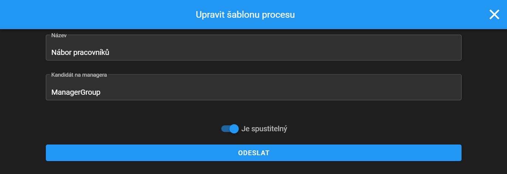
3. Proveďte vámi požadované úpravy.
4. Pomocí __dolního modrého talcítka Odeslat__ odešlete změny.

### Smazání šablony procesů ze systému
1. Přejtěte na obrazovku __Šablony procesů__

2. Klikněte na __tlačítko s trojtečkou__ a ve zobrazené nabídce vyberte možnost __Smazat__.
3. Potvrťte smazání.

> __Pozor!__ Smazání šablony procesu odstraní i všechny její podelementy, ze kterých se šablona skládá (šablony uzlů, datových objektů, sekvenčních toků aj.), a také instance procesů z ní vytvořené (Instance procesů, instance uzlů atd.).

### ...

### Spuštení nové instance podnikového procesu
### Stažení běžící instance podnikového procesu
### Smazání instance podnikového procesu

### ...

### Obsloužení čekající instance uzlu/úlohy

### ...

### Vytvoření nového uživatele 
1. Přejtěte na obrazovku __Uživatelé__

2. V pravém dolním rohu klikněte na __kulaté modré tlačítko s ikonou plus__.
3. Otevřel se vám dialog __Vytvořit nového uživatele__.
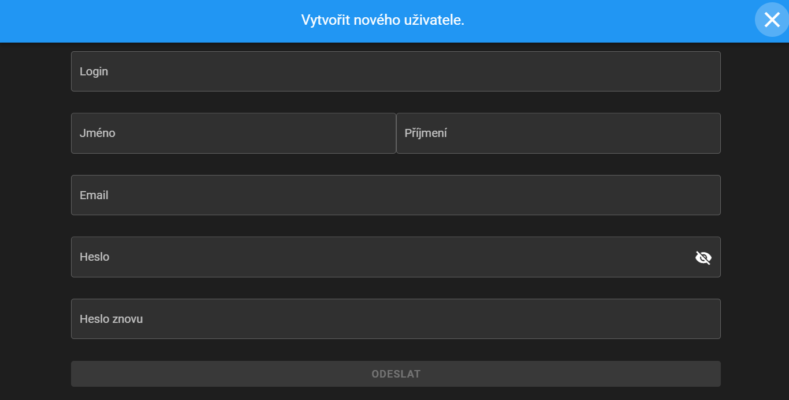
4. Vyplnte údaje
5. Odeštete požadavek na server kliknutím na __spodní modré tlačítko Odeslat__.

### Upravení informací uživatele
1. Přejtěte na obrazovku __Uživatelé__

2. Klikněte na __tlačítko s trojtečkou__ a ve zobrazené nabídce vyberte možnost __Upravit__.
3. Otevře se vám dialog __Upravit uživatele__.
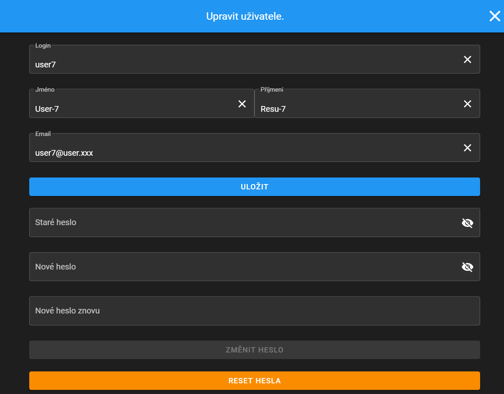
4. Změňte údaje
5. Uložte změny kliknutím na __modré tlačítko Uložit__.

### Změna hesla uživatele
1. Přejtěte na obrazovku __Uživatelé__

2. Klikněte na __tlačítko s trojtečkou__ a ve zobrazené nabídce vyberte možnost __Upravit__.
3. Otevře se vám dialog __Upravit uživatele__.

4. Zadejte staré heslo uživatele
5. Zadejte nové heslo
6. Zopakujte nové heslo
7. Odšlete změny kliknutím na __modré tlačítko Změnit heslo__.

### Restart hesla uživatele
1. Přejtěte na obrazovku __Uživatelé__

2. Klikněte na __tlačítko s trojtečkou__ a ve zobrazené nabídce vyberte možnost __Upravit__.
3. Otevře se vám dialog __Upravit uživatele__.

4. Klikněte na __Oranžovo-žluté tlačítko Reset hesla__.
5. Nové heslo se zobrazí v zeleném oznámení.

### Uzamknutí/Odemknutí uživatelského účtu
1. Přejtěte na obrazovku __Uživatelé__

2. Klikněte na __tlačítko s trojtečkou__ a ve zobrazené nabídce vyberte možnost __Odemknout__/__Uzamknout__.
3. Potvrťte akci.

### Odstranění/Obnovení uživatele
1. Přejtěte na obrazovku __Uživatelé__

2. Klikněte na __tlačítko s trojtečkou__ a ve zobrazené nabídce vyberte možnost __Odstranit__/__Obnovit__.
3. Potvrťte akci.

### Trvalé smazání uživatele
1. Přejtěte na obrazovku __Uživatelé__

2. Klikněte na __tlačítko s trojtečkou__ a ve zobrazené nabídce vyberte možnost __Smazat__.
3. Potvrťte akci.

> __Pozor!__ Smazání uživatelského účetu nadobro. Tato akce není povolena nad uživateli, kteří jsou zanešení v historii vykonávání obsluhy instancí.

### ...

### Vytvoření nové uživatelské skupiny
### Upravení informací o uživatelské skupině
### Odstranění/Obnovení uživatelské skupiny
### Trvalé smazání uživatelské skupiny

### Přidání uživatele do skupiny
### Odebrání uživatele ze skupiny
### Přidání/Odebrání lokálních práv pro administraci členů skupiny 

## ...
